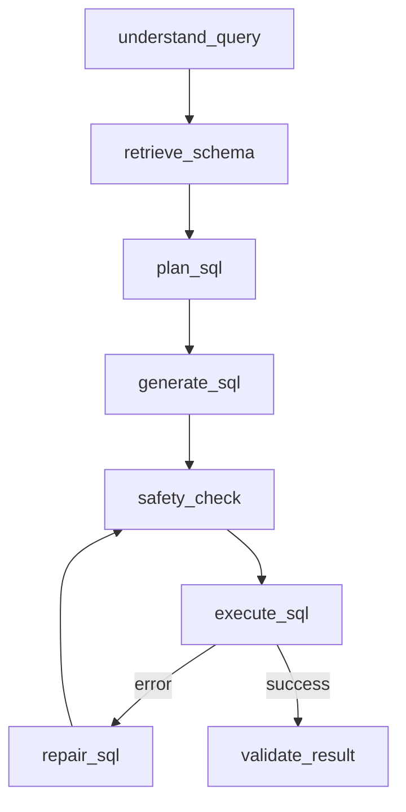

# DeepInsight LangGraph NL2SQL Agent

DeepInsight 是一个基于 LangGraph 的自然语言数据分析 Agent。用户在 Streamlit 前端输入业务问题后，系统会检索相关表和字段、规划 SQL、生成安全只读 SQL、执行查询、在失败时尝试修复，并返回表格、图表、业务洞察和 Agent Trace。

## 核心能力

- LangGraph 多节点工作流：理解问题、Schema Linking、SQL Planning、SQL 生成、安全检查、执行、修复、结果校验。
- RAG / Schema Linking：复用现有 `IntelRAG`，支持向量粗排、LLM 精排、术语匹配、Few-shot 示例匹配。
- SQL 安全：默认只允许 `SELECT` / `WITH`，拒绝多语句和写操作，优先使用 `sqlglot` 做解析校验。
- 前端 Demo： Streamlit 聊天式界面，展示 SQL、结果表格、图表、业务洞察和 Agent Trace。
- 评估套件： `eval_suite/`，支持基于 Northwind / AdventureWorks 的执行准确率、延迟和 token 统计。
  
> 基于 LangGraph 构建自然语言数据分析 Agent，设计 Query Understanding、Schema Linking、SQL Planning、SQL Safety Check、Execution、Repair、Result Validation 多节点工作流；结合 RAG 检索相关表字段与 Few-shot 示例生成只读 SQL，并在 Streamlit 前端展示 SQL、表格、图表、业务洞察和 Agent Trace；基于 Northwind / AdventureWorks 构建评估套件统计执行准确率、修复成功率、延迟和 token 成本。


## 当前架构

```text
Streamlit UI (app.py)
  -> FastAPI SSE / local adapter
  -> LangGraph NL2SQL Agent
  -> RAG + SQL Safety + SQL Executor
  -> Database
```



## 项目结构

```text
deepinsight_core/
  graph/          # LangGraph state、nodes、runner、events
  nl2sql/         # SQL safety、NL2SQL typed payloads
  services/       # API client、RAG adapter、SQL generation/execution service
deepinsight_api/  # FastAPI backend
eval_suite/       # benchmark、metrics、reports
data/             # demo database、schema、prompt config
ui/               # Streamlit styles and panels
app.py            # Streamlit frontend entry
```

## 快速开始

```bash
conda activate deepinsight
pip install -r requirements.txt
```

配置 `.env`：

```bash
DEEPINSIGHT_API_KEY=
DEEPINSIGHT_API_BASE=https://api.deepseek.com
DEEPINSIGHT_MODEL_NAME=deepseek-reasoner
DEEPINSIGHT_QUERY_RUNTIME=api
DEEPINSIGHT_API_SERVER_URL=http://127.0.0.1:8000
DEEPINSIGHT_NORTHWIND_DB_URI=mysql+pymysql://root@localhost:3306/northwind
```

启动后端：

```bash
uvicorn deepinsight_api.main:app --host 127.0.0.1 --port 8000
```

启动前端：

```bash
streamlit run app.py
```

## 评估

快速冒烟：

```bash
python -m eval_suite.run_all --accuracy-only --test-mode --database northwind
```

单元测试：

```bash
pytest tests/test_refactor_foundation.py -q
```

## 安全约束

- 不在仓库中保存真实 API Key。
- 数据库密码建议只通过环境变量或本地 `.env` 提供。
- 生产或演示环境请使用只读数据库账号。
- `/v1/sql/execute` 仅面向本地 demo，不建议直接暴露到公网。
