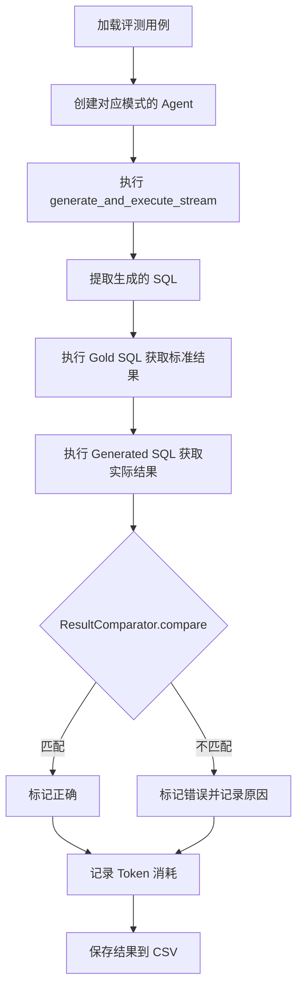

# DeepInsight Text-to-SQL 系统实验设计文档

> **文档版本**: v2.1  
> **更新日期**: 2026-03-08  
> **作者**: DeepInsight 研发团队

---

## 1. 实验目标

### 1.1 研究问题
验证基于 OpenVINO 加速的 RAG 检索与知识增强（KECA）策略对 Text-to-SQL 系统准确率的提升效果，并量化 Agent 自愈机制对系统性能上限的贡献。

### 1.2 研究假设

| 假设编号 | 假设内容 | 验证方式 |
|----------|----------|----------|
| **H1** | RAG 精排检索能有效降低 LLM 输入噪声，提高 SQL 生成准确率 | G2 > G1 |
| **H2** | KECA 知识增强（术语词典 + Few-Shot 示例）能进一步提升准确率 | G2 相比无 KECA 基线 |
| **H3** | Agent 自愈机制能修复精排阶段的"表遗漏"问题，达到性能上限 | G3 > G2 |
| **H4** | 二阶段检索（粗排→精排）能在保证准确率的同时大幅降低 Token 消耗 | Token 节省 > 80% |

---

## 2. 实验设计

### 2.1 实验组定义

采用三组对比实验设计（G1-G3），遵循单一变量控制原则：

| 实验组 | 模式名称 | RAG 检索 | KECA 注入 | Agent 自愈 | 学术意义 |
|--------|----------|:--------:|:---------:|:----------:|----------|
| **G1** | BASELINE | ❌ | ❌ | ❌ | LLM 在全量 Schema 高噪声环境下的性能基准 |
| **G2** | KNOWLEDGE_RAG | ✅ | ✅ | ❌ | 量化"精排检索 + 知识增强"的 Token 效率与准确率收益 |
| **G3** | FULL_SYSTEM | ✅ | ✅ | ✅ | 验证 Agent 自愈修复精排遗漏的性能上限 |

### 2.2 自变量

| 变量 | G1 值 | G2 值 | G3 值 |
|------|-------|-------|-------|
| `rag_engine` | `None` | `IntelRAG` | `IntelRAG` |
| `config` (KECA) | `None` | 启用 | 启用 |
| `max_retries` | 0 | 0 | 配置控制（评测默认 4） |
| `max_candidates` | 1 | 1 | 1 |

### 2.3 控制变量

以下参数在所有实验组中保持一致：

| 变量 | 固定值 | 说明 |
|------|--------|------|
| `model_name` | `deepseek-chat` | 生成模型 |
| `temperature` | 0.0 | 确保输出确定性 |
| `embedding_model` | `bge-small-zh-v1.5` | OpenVINO 格式 |
| `database` | AdventureWorks | 测试数据库 |
| `evaluation_set` | 50 道题 | 覆盖全难度等级 |

### 2.4 因变量

| 指标 | 计算方式 | 意义 |
|------|----------|------|
| **EX (Execution Accuracy)** | `(正确数 / 总数) × 100%` | Spider 评测核心指标 |
| **Token 消耗** | 累计 `total_tokens` | 成本效率指标 |
| **执行时间 (ms)** | `end - start` | 响应速度 |
| **按难度准确率** | 分 Easy/Medium/Hard/Extra-Hard | 细粒度分析 |

---

## 3. 实验条件

### 3.1 硬件环境

| 组件 | 规格 |
|------|------|
| CPU | Intel Core Ultra 7 / 12th Gen i7+ |
| 内存 | 16GB+ |
| GPU | 集成 NPU (可选) |
| 存储 | SSD |

### 3.2 软件环境

| 组件 | 版本 |
|------|------|
| Python | 3.10+ |
| OpenVINO Runtime | 2024.0+ |
| SQLAlchemy | 2.0+ |
| 数据库 | MySQL 8.0 (AdventureWorks) |

### 3.3 模型配置

```json
{
  "model_name": "deepseek-chat",
    "api_base": "https://api.deepseek.com",
  "temperature": 0.0,
  "embedding_model": "bge-small-zh-v1.5",
  "embedding_dimension": 512,
  "reasoner_model": "deepseek-reasoner",
  "use_reasoner_for_healing": false
}
```
 > 这里实验了几次发现false反而效果更好，不清楚是不是api的问题，所有暂时设置为false
---

## 4. 评测数据集

### 4.1 数据集概述

| 属性 | 值 |
|------|------|
| 数据库 | AdventureWorks (企业级 ERP 数据库) |
| 题目数量 | 50 道 |
| 表数量 | 70 张 |
| 语言 | 中文自然语言问题 |

### 4.2 难度分布

| 难度 | 数量 | 占比 | 典型特征 |
|------|------|------|----------|
| **Easy** | 10 | 20% | 单表查询、简单聚合 |
| **Medium** | 22 | 44% | 2-3 表 JOIN、GROUP BY |
| **Hard** | 14 | 28% | 多表 JOIN、子查询、CTE |
| **Extra-Hard** | 4 | 8% | 复杂嵌套、窗口函数、相关子查询 |

### 4.3 Gold SQL 表依赖统计

基于 50 道题的 Gold SQL 分析：

| 难度 | 平均表数 | P50 | P75 | P90 |
|------|----------|-----|-----|-----|
| Easy | 1.2 | 1 | 1 | 2 |
| Medium | 2.3 | 2 | 3 | 3 |
| Hard | 3.1 | 3 | 4 | 4 |
| Extra-Hard | 4.2 | 4 | 5 | 5 |

---

## 5. 评测指标

### 5.1 主要指标：EX (Execution Accuracy)

遵循 Spider 评测标准：

```python
def is_correct(gold_df, gen_df):
    """执行正确性判定（EX 指标）"""
    # 1. 行数必须相等
    if len(gold_df) != len(gen_df):
        return False
    
    # 2. 值集合比较（忽略列顺序和行顺序）
    gold_rows = normalize_dataframe(gold_df)
    gen_rows = normalize_dataframe(gen_df)
    return gold_rows == gen_rows
```

### 5.2 辅助指标

| 指标 | 计算方式 |
|------|----------|
| **Token 节省率** | `1 - (G2_tokens / G1_tokens)` |
| **自愈成功率** | `G3修复数 / (G2失败数 ∩ G3成功数)` |
| **平均响应时间** | `Σ(execution_time) / N` |
| **P95 响应时间** | `percentile(execution_time, 95)` |

---

## 6. 实验流程

### 6.1 单次评测流程



### 6.2 批量评测流程

1. 加载 `evaluation_set_adventureworks.json`
2. 对每个实验组 (G1/G2/G3) 依次执行：
   - 创建对应配置的 Agent
   - 遍历 50 道题，收集结果
   - 保存到 `results_{mode}_{timestamp}.csv`
3. 生成汇总报告

---

## 7. RAG 二阶段检索配置

### 7.1 粗排阶段 (Rough Retrieval)

| 参数 | 值 | 说明 |
|------|------|------|
| `rough_top_k` | 12 | 从嵌入向量索引召回的候选表数量 |
| （说明） | 当前主线未实现名为 `similarity_threshold` / `small_schema_threshold` 的显式配置参数；相关裁剪由固定 top-k、LLM 精排与依赖补全逻辑承担 | 避免与代码实现偏离 |

### 7.2 精排阶段 (LLM Pruning)

| 参数 | 值 | 说明 |
|------|------|------|
| `pruning_top_k` | 5 | LLM 精排后保留的核心表数量 |
| `min_tables` | 3 | 最少保留表数 |
| `max_tables` | 8 | 最终上限（含依赖补全） |
| `max_dependency_additions` | 3 | 外键补全最多添加表数 |

### 7.3 KECA 知识增强

| 组件 | 配置 | 说明 |
|------|------|------|
| 术语词典 | `term_dictionary` | 业务术语 → SQL 表达式映射 |
| Few-Shot 示例 | `example_queries` | 语义匹配注入 |
| 业务规则 | `query_patterns` | CTE/JOIN 模式指导 |

---

## 8. Agent 自愈机制配置

### 8.1 错误分类

| 错误类型 | 检测模式 | 修复策略 |
|----------|----------|----------|
| 表不存在 | `Table '...' doesn't exist` | 模糊匹配 + Schema 补全 |
| 列不存在 | `Unknown column '...'` | 候选列推荐 |
| 语法错误 | `You have an error in your SQL syntax` | CTE 修复 + 错误上下文 |

### 8.2 自愈参数

| 参数 | G3 值 | 说明 |
|------|-------|------|
| `max_retries` | 配置控制（评测默认 4） | 最大自愈次数 |
| `use_reasoner_for_healing` | false（默认，可配置） | 是否启用深度推理模型 |
| `reasoner_model` | `deepseek-reasoner` | 推理模型 |
| `max_dependency_heal` | 2 | 每次自愈最多补全表数 |

---

## 9. 数据收集方法

### 9.1 结果记录

每个评测用例记录以下字段到 CSV：

| 字段 | 类型 | 说明 |
|------|------|------|
| `case_id` | string | 用例 ID |
| `difficulty` | string | 难度等级 |
| `question` | string | 自然语言问题 |
| `gold_sql` | string | 标准答案 SQL |
| `generated_sql` | string | 系统生成 SQL |
| `is_correct` | boolean | EX 判定结果 |
| `execution_time_ms` | float | 执行耗时 |
| `total_tokens` | int | Token 消耗 |
| `error_message` | string | 错误信息 |

### 9.2 汇总统计

每个实验组汇总以下指标：

- 总体准确率 (Overall Accuracy)
- 按难度准确率 (Accuracy by Difficulty)
- 平均 Token 消耗 (Avg Tokens)
- 平均执行时间 (Avg Latency)
- P95 响应时间 (P95 Latency)

---

## 10. 预期结果

### 10.1 准确率预期

| 指标 | G1 基线 | G2 目标 | G3 目标 |
|------|---------|---------|---------|
| **Overall** | 60-66% | 68-72% | 72-75% |
| **Easy** | 80%+ | 90%+ | 90%+ |
| **Medium** | 65-70% | 77-82% | 80-85% |
| **Hard** | 35-45% | 50-57% | 55-65% |
| **Extra-Hard** | 0-10% | 25-40% | 40-60% |

### 10.2 效率预期

| 指标 | G1 | G2 | G3 |
|------|------|------|------|
| **Avg Tokens** | ~18,000 | ~2,000 | ~2,800 |
| **Token 节省** | - | ~85% | ~80% |

### 10.3 最新实测结果（2026-03-13）

基于 AdventureWorks 50 道题单轮准确率评测与 10 轮性能评测，得到如下最新结果：

| 组别 | 平均响应时间 (ms) | P95 响应时间 (ms) |
|------|------------------|-------------------|
| G1 Baseline | 7424.4 | 12169.0 |
| G2 RAG+KECA | 9495.1 | 16686.3 |
| G3 Full System | 12006.9 | 25379.1 |

| 指标 | PyTorch FP32 | OpenVINO FP32 | 实测提升 |
|------|-------------|--------------|----------|
| 平均延迟 | 3.4±0.1 ms | 1.0±0.1 ms | 3.50x |
| P95 延迟 | 4.4 ms | 1.6 ms | 2.75x |
| 吞吐量 | 292.8 QPS | 1013.8 QPS | 3.50x |

说明：响应时间统计来自端到端 `execution_time_ms`；性能数据来自 `python -m eval_suite.run_all --performance-only --runs 10` 的 10 轮平均结果。

---

## 11. 性能评测实验设计

### 11.1 评测目标

量化 OpenVINO 优化对 Embedding 模型推理性能的提升，包括延迟、吞吐量两个维度。

### 11.2 评测后端

| 后端 | 说明 | 基准对比 |
|------|------|----------|
| **PyTorch FP32** | 原生 HuggingFace 模型 | 基准（Baseline） |
| **OpenVINO FP32** | OpenVINO 优化后的模型 | 对比基准 |

### 11.3 评测指标

| 指标 | 说明 | 计算方式 | 单位 |
|------|------|----------|------|
| `latency_avg_ms` | 平均推理延迟 | 所有采样延迟的均值 | ms |
| `latency_p50_ms` | P50 延迟 | 中位数（线性插值） | ms |
| `latency_p95_ms` | P95 延迟 | 95 百分位（线性插值） | ms |
| `latency_std_ms` | 延迟标准差 | 多轮运行时的标准差 | ms |
| `throughput_qps` | 吞吐量 | 1000 / 平均延迟 | queries/s |
| `speedup_vs_baseline` | 加速比 | PyTorch 延迟 / OpenVINO 延迟 | - |

### 11.4 评测流程

```
1. 收集系统硬件信息（CPU、内存、OS）
2. 初始化性能评测器
3. 对每个推理后端依次执行：
   a. 加载模型到内存
   b. 对每个测试查询执行：
      i. 预热 3 次（不计入统计）
      ii. 采样 N 次（计入统计）
   c. 卸载模型 + GC + 清理缓存（确保隔离）
4. 计算统计指标（均值、P50、P95、标准差）
5. 计算加速比（以 PyTorch FP32 为基准）
6. （可选）多轮运行取平均
```

### 11.5 关键设计细节

#### 11.5.1 延迟测量优化

**设计思路**：确保只测量纯推理时间，排除 Tokenization 开销。

**实现方式**：
```
Tokenization（计时外）→ 推理（计时内）→ 后处理（计时外）
```

#### 11.5.2 百分位数计算

**设计思路**：使用统计学标准的线性插值方法，与 NumPy `percentile()` 一致。

**计算公式**：
```
idx = (n - 1) * p / 100
lower = floor(idx), upper = lower + 1
result = data[lower] + (idx - lower) * (data[upper] - data[lower])
```


#### 11.5.4 完整预热机制

**设计思路**：每个查询都进行预热，避免冷启动延迟影响结果。

**实现方式**：对每个测试查询，先运行 3 次预热，再进行采样。

#### 11.5.5 多轮运行取平均

**设计思路**：通过多次运行取平均，降低系统噪声影响，提高结果稳定性。

**实现方式**：
- 运行 N 轮完整评测
- 对每轮的延迟、吞吐量分别取平均
- 计算延迟的标准差，评估结果波动范围

### 11.6 测试查询集

使用 5 个不同长度的查询，覆盖典型使用场景：

| 类型 | 示例 |
|------|------|
| 短查询 | "统计订单总数" |
| 中查询 | "查询2023年每月销售额" |
| 长查询 | "分析各地区客户订单金额分布，按季度统计TOP10客户" |

### 11.7 预期性能结果

| 指标 | PyTorch FP32 | OpenVINO FP32 | 预期提升 |
|------|-------------|--------------|----------|
| 平均延迟 | ~15ms | ~5ms | ~3x |
| P95 延迟 | ~20ms | ~7ms | ~2.9x |
| 吞吐量 | ~67 QPS | ~200 QPS | ~3x |

---

## 12. 运行命令

```bash
# 完整评测（三组实验，50 道题，各 3 轮取平均）
python -m eval_suite.run_all --database adventureworks --runs 3

# 快速测试（10 道题）
python -m eval_suite.run_all --database adventureworks --limit 10

# 仅运行 G2 组
python -m eval_suite.bench_accuracy --mode knowledge_rag --database adventureworks

# 仅运行性能评测（3 轮取平均）
python -m eval_suite.run_all --performance-only --runs 3

# 查看帮助
python -m eval_suite.run_all --help
```

### 常用参数说明

| 参数 | 说明 | 示例 |
|------|------|------|
| `--groups` | 选择实验组 (G1-G3) | `--groups G1 G2 G3` |
| `--database` | 选择数据库 | `--database adventureworks` |
| `--limit N` | 限制评测题目数量 | `--limit 10` |
| `--runs N` | 多轮运行取平均（准确率 + 性能） | `--runs 3` |
| `--samples N` | 性能评测每查询采样次数 | `--samples 5` |
| `--accuracy-only` | 仅运行准确率评测 | `--accuracy-only` |
| `--performance-only` | 仅运行性能评测 | `--performance-only` |
| `--test-mode` | 快速测试模式（3道题） | `--test-mode` |

---

## 12. 参考文献

1. **Spider**: Yu T, et al. "Spider: A Large-Scale Human-Labeled Dataset for Complex and Cross-Domain Semantic Parsing and Text-to-SQL Task." EMNLP 2018.
2. **RAG**: Lewis P, et al. "Retrieval-Augmented Generation for Knowledge-Intensive NLP Tasks." NeurIPS 2020.
3. **OpenVINO**: Intel OpenVINO Toolkit Documentation.
