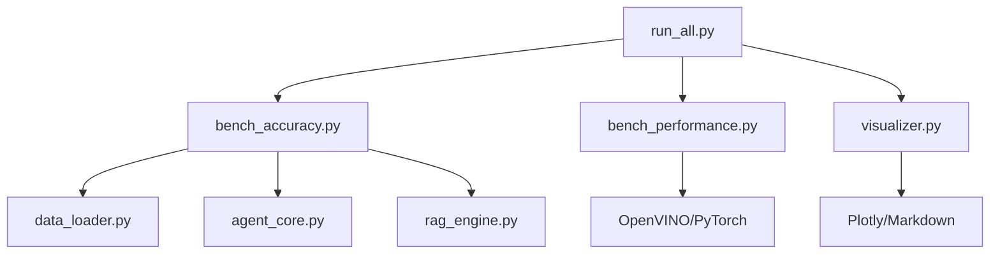

# eval_suite 技术文档

> **版本**: 4.0  
> **更新日期**: 2026-02-22  
> **作者**: DeepInsight 团队

---

## 版本历史

| 版本 | 日期 | 主要变更 |
|------|------|----------|
| **v4.0** | 2026-02-22 | 性能评测重大升级：多轮运行平均、延迟测量优化、内存隔离测量、百分位数计算修正、完整文档同步 |
| v3.0 | 2026-02-08 | 简化实验设计、动态自愈机制、Token 消耗统计 |
| v2.0 | 2026-02-04 | 结果隔离、KECA 知识增强 |
| v1.0 | 2026-01-15 | 初始版本 |

---

## v4.0 重要更新

### 🔴 关键修复
1. **性能评测支持多轮运行取平均** - 与准确率评测保持一致，使用 `--runs N` 参数
2. **延迟测量优化** - Tokenization 现在在计时前完成，确保只测量推理时间
3. **内存隔离测量** - 添加模型卸载机制，确保各后端内存测量互不干扰
4. **百分位数计算修正** - 使用标准线性插值方法（P50/P95）
5. **完整预热机制** - 每个查询都进行预热，而非仅第一个查询

### 📊 新增指标
- `latency_std_ms` - 延迟标准差（多轮运行时）
- `run_count` - 运行次数
- `averaged_performance_results.json` - 多轮平均结果文件

### 🎨 可视化增强
- Rich 表格显示延迟标准差
- Markdown 表格支持多轮运行标注
- visualizer 优先加载平均结果

---

## 一、精简使用指南

### 1.1 快速启动

```powershell
# 激活环境
sh
conda activate deepinsight

# 运行全部评测（G1-G3 三组实验）
python -m eval_suite.run_all

# 选择特定实验组
python -m eval_suite.run_all --groups G1 G2 G3

# 使用 AdventureWorks 数据库 (70 表)
python -m eval_suite.run_all --database adventureworks

# 仅运行准确率评测
python -m eval_suite.run_all --accuracy-only

# 仅运行性能评测
python -m eval_suite.run_all --performance-only

# 快速测试模式（3道题，验证流程）
python -m eval_suite.run_all --test-mode
```

### 1.2 常用参数

| 参数 | 说明 | 示例 |
|------|------|------|
| `--groups` | 选择实验组 (G1-G3) | `--groups G1 G2 G3` |
| `--database` | 选择数据库 | `--database adventureworks` |
| `--limit N` | 限制评测题目数量 | `--limit 10` |
| `--runs N` | 多轮运行取平均（减少随机性） | `--runs 3` |
| `--samples N` | 性能评测每查询采样次数 | `--samples 5` |
| `--quiet` | 安静模式，减少输出 | `--quiet` |

### 1.3 输出位置

```
eval_suite/results/
├── {database}_{mode}_{timestamp}/  # 隔离结果目录 (v2.0 新增)
│   ├── results.csv                # 详细结果
│   └── generated_sql.json         # 生成的 SQL
├── accuracy_results.json          # 准确率评测原始数据
├── performance_results.json       # 性能评测原始数据
├── averaged_performance_results.json  # 性能评测多轮平均结果 (v4.0 新增)
├── system_info.json               # 系统硬件信息
├── experiment_report.md           # Markdown 格式报告
└── charts/
    ├── accuracy_comparison.html   # 准确率对比图
    ├── performance_radar.html     # 性能雷达图
    └── latency_distribution.html  # 延迟分布箱线图
```

> **v2.0 结果隔离**: 每次实验运行结果保存到独立目录，格式为 `{database}_{mode}_{timestamp}/`，避免覆盖。

---

## 二、模块架构

```
eval_suite/
├── __init__.py                        # 模块导出
├── run_all.py                         # 一键运行入口（CLI）
├── bench_accuracy.py                  # 准确率评测核心
├── bench_performance.py               # 性能评测核心
├── data_loader.py                     # 评测数据加载器
├── visualizer.py                      # 可视化与报告生成
├── evaluation_set.json                # Northwind 评测集（50题）
├── evaluation_set_adventureworks.json # AdventureWorks 评测集（50题）
└── results/                           # 评测结果输出目录
```

### 支持的数据库

| 数据库 | 表数量 | 评测集 | 适用场景 |
|--------|--------|--------|----------|
| **Northwind** | 8 表 | 50 题 | 快速验证，基线测试 |
| **AdventureWorks** | 70 表 | 50 题 | RAG 效果验证，大规模 Schema |

### 模块依赖关系



---

## 三、准确率评测设计

### 3.1 三组对比实验 (G1-G3) 🔄

准确率评测采用**消融实验**设计，通过逐步启用系统组件，量化各组件对准确率的贡献。

| 实验组 | 模式名称 | RAG检索 | KECA注入 | Agent自愈 | 学术意义 |
|--------|------------------|:-------:|:--------:|:---------:|-----------------------------|
| **G1** | BASELINE | ❌ | ❌ | ❌ | 模型原始能力上限 |
| **G2** | KNOWLEDGE_RAG | ✅ | ✅ | ❌ | RAG + KECA 的综合贡献 |
| **G3** | FULL_SYSTEM | ✅ | ✅ | ✅ | 闭环自愈补偿效果 |

> **v3.0 更新**: 原 G2 (RAG-Only) 和 G3 (KECA-Integrated) 合并为新 G2 (KNOWLEDGE_RAG)，简化实验设计。

#### KECA (Knowledge-Enhanced Context Augmentation)

KECA 是 v2.0 新增的知识增强模块，包含三个组件：
- **业务上下文 (business_context)**: 行业术语、业务规则
- **术语词典 (term_dictionary)**: 专业术语到 SQL 映射
- **Few-shot 示例 (example_queries)**: 典型查询模板

#### Δ增量分析

- `Δ_Knowledge = G2 - G1` → RAG + KECA 综合贡献
- `Δ_Self-Healing = G3 - G2` → 自愈机制贡献
- `Total Improvement = G3 - G1` → 系统总提升

### 3.2 EX 指标定义

采用 **Spider 基准测试的 EX (Execution Accuracy)** 指标：

> **定义**: 当且仅当生成SQL的执行结果与Gold SQL的执行结果**逻辑等价**时，判定为正确。

**EX vs EM 对比**:

| 指标 | 定义 | 优点 | 缺点 |
|------|------|------|------|
| **EM** (Exact Match) | SQL 字符串完全匹配 | 简单直接 | 过于严格，等价SQL被判错 |
| **EX** (Execution) | 执行结果等价 | 更公平合理 | 需数据库环境 |

### 3.3 结果比较算法

`ResultComparator.compare()` 实现三层渐进匹配策略：

```
┌─────────────────────────────────────────┐
│        Strategy 1: 值集合比较            │
│  (列数相同时，规范化后逐行比较)           │
└──────────────────┬──────────────────────┘
                   │ 不匹配
                   ▼
┌─────────────────────────────────────────┐
│      Strategy 2: 列子集匹配              │
│  (允许生成结果包含额外列，超集匹配)       │
└──────────────────┬──────────────────────┘
                   │ 不匹配
                   ▼
┌─────────────────────────────────────────┐
│      Strategy 3: 值包含检查              │
│  (Gold每行的值是否包含在Gen某行中)        │
└──────────────────┬──────────────────────┘
                   │ 不匹配
                   ▼
              返回 False
```

#### 规范化处理细节

```python
def normalize_value(val):
    # 1. None/NaN 统一为 "NULL"
    # 2. 数值类型 → float
    # 3. 字符串 → strip().lower()
    # 4. Decimal → float
```

```python
def normalize_dataframe(df):
    # 1. 每行转为规范化值元组
    # 2. 行内按值排序（忽略列顺序）
    # 3. 所有行排序（忽略行顺序）
    # 4. 返回 frozenset 用于哈希比较
```

**Spider EX 标准兼容性**:
- ✅ 忽略列名/别名
- ✅ 忽略列顺序
- ✅ 忽略行顺序
- ✅ 允许超集匹配（生成结果更多列）
- ✅ 行数严格相等

### 3.4 Agent 配置差异

```python
# G1 Baseline: 禁用 RAG + 禁用 KECA + 禁用重试
agent = Text2SQLAgent(
    rag_engine=MockRAG(model=None),  # 无语义搜索
    config=None,                      # ⚭ 禁用 KECA
    max_retries=0                     # 无错误恢复
)

# G2 Knowledge-RAG: 启用 RAG + 启用 KECA + 禁用重试
agent = Text2SQLAgent(
    rag_engine=IntelRAG(...),        # OpenVINO 加速 RAG
    config=config,                    # ⚭ 启用 KECA 知识增强
    max_retries=0                     # 无错误恢复
)

# G3 Full-System: 启用 RAG + 启用 KECA + 启用自愈
agent = Text2SQLAgent(
    rag_engine=IntelRAG(...),        # OpenVINO 加速 RAG
    config=config,                    # ⚭ 启用 KECA 知识增强
    max_retries=3                     # 最多3次自愈重试
)
```

> **KECA 控制机制**: 通过 `config` 参数控制。传入 `config=None` 时，`EnhancedPromptBuilder` 不会初始化，KECA 完全禁用。

### 3.5 动态自愈机制 🆕

v3.0 新增**动态自愈补全**机制，当 SQL 执行失败时自动修复表名错误：

```
┌─────────────────────────────────────────┐
│     1. 错误检测                          │
│  _detect_table_not_found_error()        │
│  检测: MySQL/SQLite/SQL Server 表错误   │
└──────────────────┬──────────────────────┘
                   │ 检测到表名
                   ▼
┌─────────────────────────────────────────┐
│     2. 表名匹配                          │
│  _match_table_from_index()              │
│  从 Database Index 模糊匹配正确表名      │
└──────────────────┬──────────────────────┘
                   │ 匹配成功
                   ▼
┌─────────────────────────────────────────┐
│     3. Schema 注入                       │
│  _get_dynamic_table_schema()            │
│  获取遗漏表的详细 Schema + 样本数据      │
└──────────────────┬──────────────────────┘
                   │ 追加到 context
                   ▼
┌─────────────────────────────────────────┐
│     4. 重试 SQL 生成                     │
│  使用补全后的 context 重新生成          │
└─────────────────────────────────────────┘
```

**匹配策略** (按优先级):
1. 精确匹配 (忽略大小写)
2. 前缀去除匹配 (tbl_, tb_, dim_, fact_)
3. 包含关系匹配
4. 编辑距离匹配 (Levenshtein ≤ 2)

### 3.6 科学性保障措施

1. **Agent 状态重置**: 每个 case 执行前调用 `agent.reset_state()` 清空错误历史
2. **多轮运行**: `--runs N` 支持多次运行取平均，计算**样本标准差** (n-1)
3. **预运行验证**: 自动验证所有 Agent 是否创建成功
4. **独立 Agent**: 多轮运行时每轮创建新 Agent，确保完全隔离
5. **Gold SQL 预验证**: 提供 `test_gold_sql.py` 脚本验证所有 Gold SQL 可执行
6. **RAG 中间态记录**: EvalResult 记录复杂度评估、检索数量等调试信息

---

## 四、性能评测设计

### 4.1 测试目标

对比 Embedding 模型在两种推理后端的性能差异：

| 后端 | 说明 |
|------|------|
| **PyTorch FP32** | 原生 HuggingFace 模型（基准） |
| **OpenVINO FP32** | OpenVINO 优化模型 |

### 4.2 测试指标

| 指标 | 说明 | 单位 | v4.0 更新 |
|------|------|------|-----------|
| `latency_avg_ms` | 平均推理延迟 | ms | 不包含 Tokenization 时间 |
| `latency_p50_ms` | P50 延迟（中位数） | ms | 标准线性插值计算 |
| `latency_p95_ms` | P95 延迟 | ms | 标准线性插值计算 |
| `latency_std_ms` | 延迟标准差（多轮运行时） | ms | 🆕 v4.0 新增 |
| `throughput_qps` | 吞吐量 | queries/sec | - |
| `memory_mb` | 内存占用 | MB | 隔离测量，无交叉干扰 |
| `speedup_vs_baseline` | 相对 PyTorch 的加速比 | - | 基于平均延迟 |
| `run_count` | 运行次数 | - | 🆕 v4.0 新增 |

### 4.3 测试流程

```
1. 收集系统硬件信息 (CPU, 内存, OS)
2. 加载 PyTorch 模型
   → 每个查询 Warmup 3次 🆕 v4.0 更新
   → 采样测试
   → 卸载模型 + GC + 清空缓存 🆕 v4.0 新增
3. 加载 OpenVINO 模型
   → 每个查询 Warmup 3次 🆕 v4.0 更新
   → 采样测试
   → 卸载模型 + GC 🆕 v4.0 新增
4. 计算统计指标 (Avg, P50, P95, Min, Max, Std)
5. 计算加速比: speedup = pytorch_latency / openvino_latency
6. （可选）多轮运行取平均，计算标准差 🆕 v4.0 新增
```

### 4.4 v4.0 关键改进详解

#### 4.4.1 延迟测量优化

**问题**：之前的实现将 Tokenization 时间计入推理延迟，导致测量不准确。

**解决方案**：Tokenization 现在在计时块之前完成，只测量纯推理时间。

```python
# 正确的测量方式（v4.0）
inputs = tokenizer(query, return_tensors="pt")  # 计时外
start_time = time.time()
outputs = model(**inputs)  # 只测量推理
latency_ms = (time.time() - start_time) * 1000
```

#### 4.4.2 百分位数计算修正

**问题**：之前使用简单索引选择（`latencies[int(len*0.95)]`），不符合统计学标准。

**解决方案**：使用标准的线性插值方法，与 NumPy 的 `percentile()` 方法一致。

```python
def calculate_percentile(data_sorted, percentile):
    """标准百分位数计算（线性插值）"""
    n = len(data_sorted)
    idx = (n - 1) * percentile / 100.0
    lower = int(idx)
    upper = lower + 1
    weight = idx - lower
    
    if upper >= n:
        return data_sorted[lower]
    
    return data_sorted[lower] + weight * (data_sorted[upper] - data_sorted[lower])
```

#### 4.4.3 内存隔离测量

**问题**：PyTorch 模型加载后内存没有清理，导致 OpenVINO 的内存测量受影响。

**解决方案**：测试完一个后端后，主动卸载模型、清理 PyTorch 缓存、强制垃圾回收。

```python
def _unload_model(self, backend):
    """卸载模型并清理内存"""
    if backend in self._models:
        del self._models[backend]
    if backend in self._tokenizers:
        del self._tokenizers[backend]
    
    if torch.cuda.is_available():
        torch.cuda.empty_cache()
    
    gc.collect()
```

#### 4.4.4 完整预热机制

**问题**：之前只预热第一个查询，其他查询的冷启动延迟影响结果。

**解决方案**：每个查询都进行预热，确保所有查询都在稳定状态下测量。

```python
# 预热每个查询
for query in queries:
    for _ in range(warmup_runs):
        self._measure_inference(backend, query)
```

#### 4.4.5 多轮运行取平均

**问题**：性能评测没有多次运行取平均，结果波动较大。

**解决方案**：与准确率评测保持一致，支持 `--runs N` 参数，自动计算平均值和标准差。

```python
# 运行多轮
for run_idx in range(runs):
    benchmark = PerformanceBenchmark()
    summaries = benchmark.run_all(...)
    all_runs_summaries.append(summaries)

# 计算平均
avg_latency = sum(all_latencies) / len(all_latencies)
std_latency = calc_std(all_latencies, avg_latency)
```

### 4.4 测试查询集

```python
TEST_QUERIES = [
    # 短查询 (模拟简单问题)
    "统计订单总数", "查询所有产品",
    # 中等查询 (典型用户问题)
    "查询2023年每月销售额",
    # 长查询 (复杂业务问题)
    "分析各地区客户订单金额分布，按季度统计TOP10客户"
]
```

---

## 五、数据集规范

### 5.1 难度等级定义

遵循 **Spider 基准测试**的难度划分标准：

| 难度 | SQL 特征 | 示例 |
|------|---------|------|
| **Easy** | 单表、无嵌套、简单 WHERE | `SELECT * FROM products` |
| **Medium** | GROUP BY、HAVING、简单嵌套 | `SELECT category, COUNT(*) FROM ... GROUP BY ...` |
| **Hard** | JOIN、子查询 | `SELECT ... FROM A JOIN B ON ... WHERE EXISTS (...)` |
| **Extra-Hard** | UNION、窗口函数、复杂嵌套 | `WITH cte AS (...) SELECT ... OVER (PARTITION BY ...)` |

### 5.2 数据集统计 (AdventureWorks)

当前 `evaluation_set_adventureworks.json` 包含 **50 道题目**：

| 难度 | 数量 | 占比 |
|------|------|------|
| Easy | 15 | 30% |
| Medium | 20 | 40% |
| Hard | 10 | 20% |
| Extra-Hard | 5 | 10% |

> **Extra-Hard 题目示例** (aw046-aw050): CTE 销售占比、ROW_NUMBER 窗口函数、累计计算、LAG 函数

### 5.3 数据结构

```json
{
    "id": "q001",
    "difficulty": "easy",
    "question": "查询所有产品类别的名称",
    "gold_sql": "SELECT CategoryName FROM categories",
    "expected_result_type": "table",
    "tags": ["single_table", "select"],
    "description": "Easy - 单表简单查询"
}
```

### 5.4 EvalResult 数据结构

评测结果记录完整的执行信息：

```python
@dataclass
class EvalResult:
    case_id: str           # 用例 ID
    difficulty: str        # 难度等级
    question: str          # 自然语言问题
    gold_sql: str          # Gold SQL
    generated_sql: str     # 生成的 SQL
    is_correct: bool       # 是否正确
    execution_time_ms: float  # 执行耗时
    error_message: str     # 错误信息
    gold_result_hash: str  # Gold 结果哈希
    gen_result_hash: str   # 生成结果哈希
    # === RAG 中间态数据 ===
    query_complexity: str  # 复杂度评估 (simple/medium/complex)
    rag_top_k: int         # RAG 检索 top_k
    rag_hints_count: int   # RAG hints 数量
    # === Token 消耗统计 (v1.3 新增) ===
    prompt_tokens: int     # Prompt Token 数
    completion_tokens: int # Completion Token 数
    total_tokens: int      # 总 Token 数
```

### 5.5 ExperimentSummary 数据结构

实验摘要记录聚合统计信息：

```python
@dataclass 
class ExperimentSummary:
    mode: str                         # 实验模式
    total_cases: int                  # 总用例数
    correct_count: int                # 正确数量
    accuracy: float                   # 准确率
    by_difficulty: Dict               # 按难度分组统计
    avg_execution_time_ms: float      # 平均执行时间
    timestamp: str                    # 时间戳
    accuracy_std: float = 0.0         # 准确率标准差
    run_count: int = 1                # 运行次数
    # === Token 消耗统计 (v1.3 新增) ===
    total_prompt_tokens: int = 0      # 总 Prompt Token
    total_completion_tokens: int = 0  # 总 Completion Token  
    total_tokens: int = 0             # 总 Token 数
    avg_tokens_per_query: float = 0.0 # 平均每查询 Token
```

### 5.6 BackendSummary 数据结构 (v4.0 新增)

性能评测后端摘要：

```python
@dataclass
class BackendSummary:
    backend: str                    # 推理后端名称
    sample_count: int               # 采样次数
    latency_avg_ms: float           # 平均延迟
    latency_p50_ms: float           # P50 延迟
    latency_p95_ms: float           # P95 延迟
    latency_min_ms: float           # 最小延迟
    latency_max_ms: float           # 最大延迟
    throughput_qps: float           # 吞吐量 (queries/s)
    memory_mb: float                # 模型内存占用 (MB)
    speedup_vs_baseline: float = 1.0  # 相对基准的加速比
    run_count: int = 1              # 运行次数 (v4.0 新增)
    latency_std_ms: float = 0.0     # 延迟标准差 (v4.0 新增)
```

---

## 六、可视化模块

### 6.1 输出格式

| 生成器 | 用途 | 输出 |
|--------|------|------|
| `MarkdownGenerator` | 论文表格 | `.md` 文件 |
| `PlotlyChartGenerator` | 交互式图表 | `.html` 文件 |
| `ASCIITablePrinter` | 终端展示 | 控制台输出 |

### 6.2 生成的图表

1. **准确率对比柱状图** (`accuracy_comparison.html`)
   - 按难度分组，对比三种实验模式

2. **性能雷达图** (`performance_radar.html`)
   - 多维度展示各后端性能

3. **延迟分布箱线图** (`latency_distribution.html`)
   - 展示推理延迟的分布特征

### 6.3 准确率表格示例

```markdown
| 实验模式 | Easy | Medium | Hard | Extra-Hard | 总体 | Avg Tokens |
|------------------|------|--------|------|------------|------|------------|
| G1 Baseline | 60% | 40% | 25% | 15% | 38% | 2850 |
| G2 Knowledge-RAG | 85% | 70% | 55% | 40% | 65% | 3200 |
| G3 Full-System | 95% | 85% | 70% | 55% | 78% | 3600 |
```

> **Avg Tokens**: v1.3 新增，显示每个查询的平均 Token 消耗量。

---

## 七、扩展指南

### 7.1 添加新评测用例

编辑 `eval_suite/evaluation_set.json`：

```json
{
    "id": "q051",
    "difficulty": "hard",
    "question": "你的自然语言问题",
    "gold_sql": "你的标准答案SQL",
    "expected_result_type": "table",
    "tags": ["join", "subquery"],
    "description": "描述信息"
}
```

### 7.2 添加新实验模式

1. 在 `ExperimentMode` 枚举中添加新模式
2. 实现 `_create_xxx_agent()` 方法
3. 实现 `run_xxx()` 方法
4. 更新 `run_all()` 调用链
5. 更新 `run_experiment()` 的 `group_map` 字典
6. 更新 `main()` 的 `--mode` choices

### 7.3 自定义比较逻辑

扩展 `ResultComparator` 类：

```python
@staticmethod
def compare_with_tolerance(gold_df, gen_df, numeric_tolerance=0.01):
    """支持数值容差的比较"""
    # 自定义实现...
```

---

## 八、故障排查

### 8.1 常见问题

| 问题 | 原因 | 解决方案 |
|------|------|----------|
| "无法导入核心模块" | 依赖未安装 | 检查 `requirements.txt` |
| "数据库连接失败" | MySQL 服务未启动 | 启动 MySQL 服务 |
| "Agent 创建返回 None" | 配置文件缺失 | 检查 `data/config.json` |
| "模拟模式运行" | Agent 不可用 | 查看警告信息排查依赖 |

### 8.2 验证 Agent 状态

```python
from eval_suite.bench_accuracy import AccuracyBenchmark

benchmark = AccuracyBenchmark()
results = benchmark.verify_all_agents()

for mode, (ok, err) in results.items():
    print(f"{mode.value}: {'✅' if ok else '❌ ' + err}")
```

---

## 九、Golden SQL 验证结果 🆕

所有评测用例的 Gold SQL 已通过验证 (2026-02-08)：

| 数据库 | 测试用例 | 通过 | 失败 |
|--------|----------|------|------|
| **Northwind** | 50 | 50 | 0 |
| **AdventureWorks** | 50 | 50 | 0 |

运行验证脚本:
```bash
python eval_suite\test_gold_sql.py              # Northwind
python eval_suite\test_gold_sql_adventureworks.py  # AdventureWorks
```

---

## 十、参考文献

1. Yu, T., et al. "Spider: A Large-Scale Human-Labeled Dataset for Complex and Cross-Domain Semantic Parsing and Text-to-SQL Task." EMNLP 2018.
2. OpenVINO Documentation: https://docs.openvino.ai/
3. Spider Benchmark: https://yale-lily.github.io/spider
